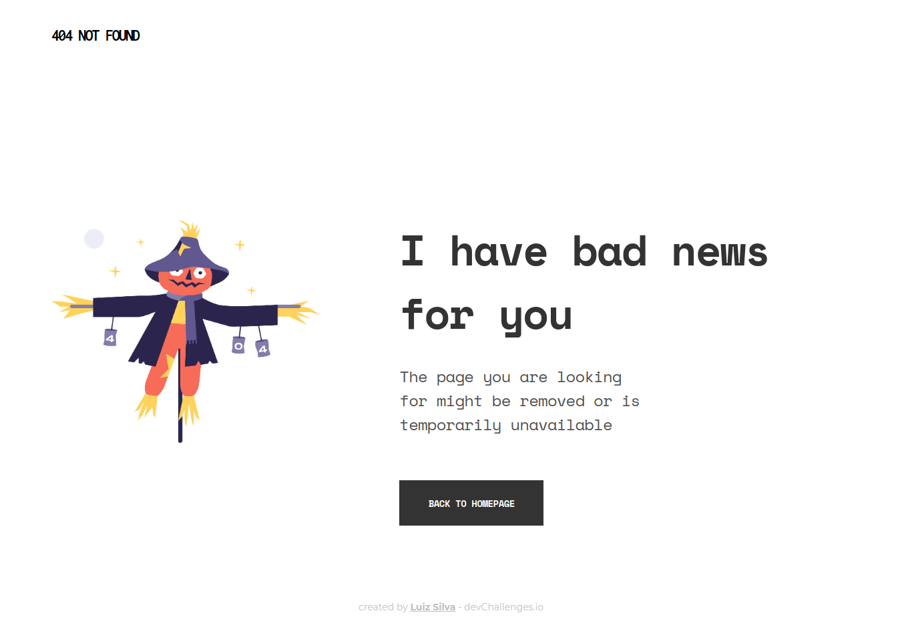

<h1 align="center">404 - Page not found</h1>

   Solution for a challenge from  <a href="http://devchallenges.io" target="_blank">Devchallenges.io</a>.

  <h3>
    <a href="#">
      Demo
    </a>
     | 
    <a href="https://github.com/lu1zf/page-not-found">
      Solution
    </a>
     | 
    <a href="https://devchallenges.io/challenges/wBunSb7FPrIepJZAg0sY">
      Challenge
    </a>
  </h3>

## Table of Contents

- [Overview](#overview)
  - [Built With](#built-with)
- [Features](#features)
- [Contact](#contact)

## Overview

This is a 404 error page made with html and css, with mobile and desktop layouts.

### Built With

- Html
- Css

## Features

This application/site was created as a submission to a [DevChallenges](https://devchallenges.io/challenges) challenge. The [challenge](https://devchallenges.io/challenges/wBunSb7FPrIepJZAg0sY) was to build a 404 page following the given layout.

## Contact

- Website [luizsilva.dev.br](https://www.luizsilva.dev.br)
- GitHub [@lu1zf](https://github.com/lu1zf)
- Linkedin [Luiz Silva](https://www.linkedin.com/in/lu1zf/)
